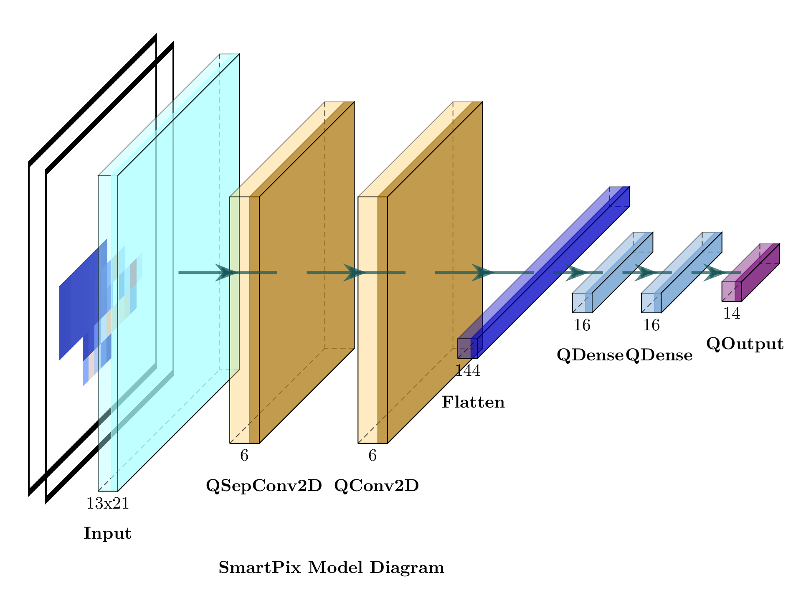

# PHYS 570 (AI) Final Project

<p align="left">
  <a href="https://iopscience.iop.org/article/10.1088/2632-2153/ad6a00"></a>
  <a href="https://arxiv.org/abs/2312.11676"></a>
</p>

The Final project has been done on the study of working with SmartPixels project with different sensor geometry and different time slices to train the models and the use of the MDMM technique to sparsify the model

Smartpixels focuses on implementing Machine learning models directly onto the silicon pixels of the future detectors, to predict the track parameters and the associated uncertainty to the predictions with NLL (Negative Log-likelihood Loss) as the loss function to minimize. This would help us to use the data of the Pixel detectors and possibly find new physics that might be missed by the lower-level triggers.

The main Github repository for the project can be found [here](https://github.com/smart-pix/smart-pixels-ml)


## Installation
1. Clone the repository:
```bash
git clone https://github.com/ArghyaDas112358/570AI_Final_Project.git
cd 570AI_Final_Project
pip install -r requirements.txt
```
## Dataset

Download the simulated data from: [zenodo](https://doi.org/10.5281/zenodo.7331128) and/or [PixelAV](https://docs.google.com/document/d/1ZoqVyJOOAXhzt2egMWh3OoNJ6lWq5lNR6sjcYON4Vlo/edit?tab=t.0#heading=h.k6tyal7z5t5l)

### Structure
- **Input Data (dataX)**: Consists of 2D images representing the charge deposited by a particle, with each channel showing a different time slice of the particle’s passage. You can choose to work with either `2` time slices (reduced) or the full `20` time slices. These correspond to input shapes of `(13, 21, 2)` and `(13, 21, 20)` respectively.
  
- **Labels (dataY)**: _Four_ target variables are chosen as the labls viz. local $x$, local $y$, $\alpha$ angle and $\beta$ angle, associated with the particle trajectory.

## Directory Structure and File Descriptions
### Notebook
- `from_weights.ipynb`: Contains the code to plot the weights of the model
- `from_weights_20t_tr_alltype.ipynb`: Contains the code to plot the weights of the models and compare them with each other, here we have compared the type 6 and 7 geometries (that has different thicknesses) and also the comparison of different time slices
- `from_weights_Comparision_mdmm.ipynb`: Contains the code to plot the comparisons of the baseline (non-mdmm i.e. with L1/L2 regularization) vs the mdmm method.

### Python Scripts and files
- `omodels.py`: Original model architecture with L1/L2 regularization.
- `models.py`: Defines the core model architecture without regularization.
- `loss.py`: Implements the Negative Log-Likelihood (NLL) loss function.
- `mdmm.py`: Contains the implementation of the MDMM method.
- `OptimizedDataGenerator.py`: Contains the data-generator implementation.
- `utils.py`: Contains general-purpose utility functions.
- `types.txt`: Contains the information about geometries of PixelAV dataset.

### Trained models
All the folder names with `trained_models` contain the trained models for different geometries and time slices. And also the mdmm and the non-mdmm training.

Each trained models have a unique name assigned randomly to each model for easy identification.
- `/trained_model/`: Contains the trained model of type 6 and 7 models (which are the the comparison for the different thicknesses)
- `/trained_model_20t/`: Contained the trained models for the 20 time slices.
- `/trained_model_mdmm/`: Contained the trained models for the mdmm method.
- `/trained_model_non_mdmm/`: Contained the trained models for the non-mdmm method.


## Model Architecture
The core model architecture is defined in [model.py](../models.py) and [omodel.py](../omodels.py). Where the original model architecture is defined in [omodel.py](../omodels.py) with the L1/L2 regularizers and the [model.py](../models.py) has no regularizers (which have been used in the MDMM cases), else the model architecture is identical.

We have implemented a MDN architecture with quantized neural network layers. We use the Negative Log-Likelihood (NLL) as the loss function implemented in [loss.py](../loss.py). A good reading about it can be found [here](https://towardsdatascience.com/mixture-density-networks-probabilistic-regression-for-uncertainty-estimation-5f7250207431)





As an example, to implement the model with 2 time slices:

```python
from model import *

model=CreateModel((13,21,2),n_filters=5,pool_size=3)
model.summary()
```
This generates a model with the following architecture:
| Type                 | Output Shape        | Parameters |
|----------------------|---------------------|------------|
| InputLayer           | `(None, 13, 21, 2)`| 0          |
| QSeparableConv2D     | `(None, 11, 19, 5)`| 33         |
| QActivation          | `(None, 11, 19, 5)`| 0          |
| QConv2D              | `(None, 11, 19, 5)`| 30         |
| QActivation          | `(None, 11, 19, 5)`| 0          |
| AveragePooling2D     | `(None, 3, 6, 5)` | 0          |
| QActivation          | `(None, 3, 6, 5)` | 0          |
| Flatten              | `(None, 90)` | 0          |
| QDense               | `(None, 16)` | 1456       |
| QActivation          | `(None, 16)` | 0          |
| QDense               | `(None, 16)` | 272        |
| QActivation          | `(None, 16)` | 0          |
| QDense               | `(None, 14)` | 238        |
